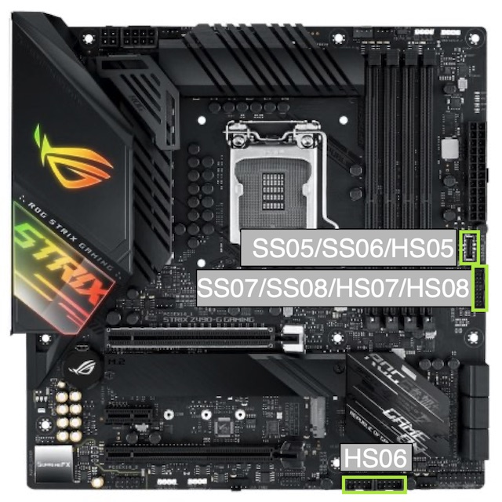
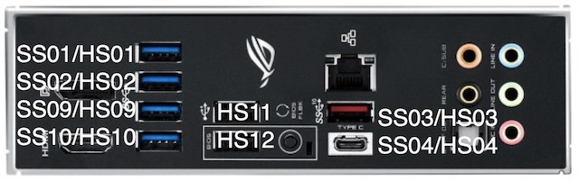
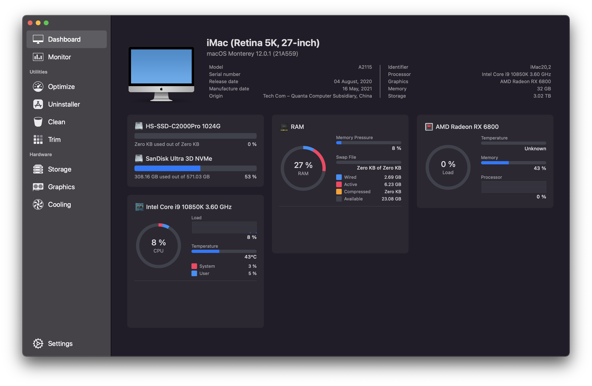
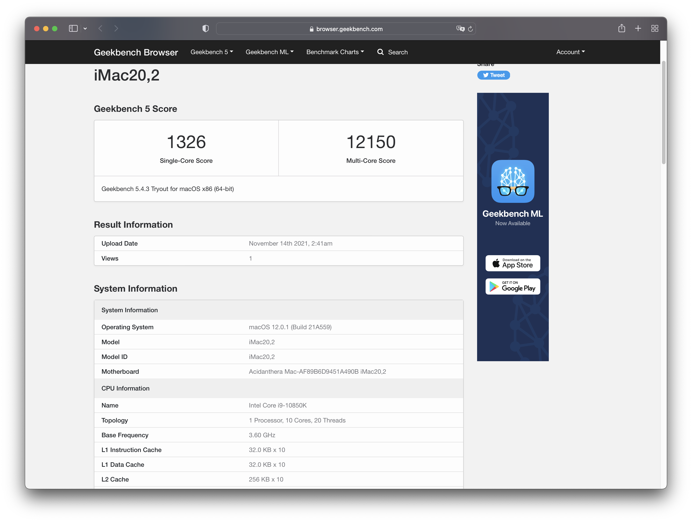
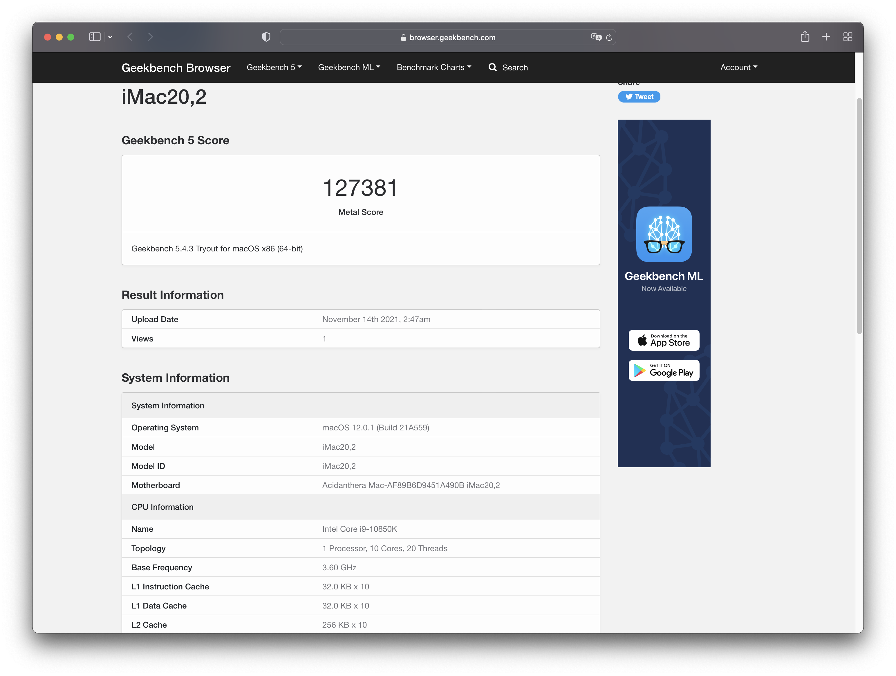
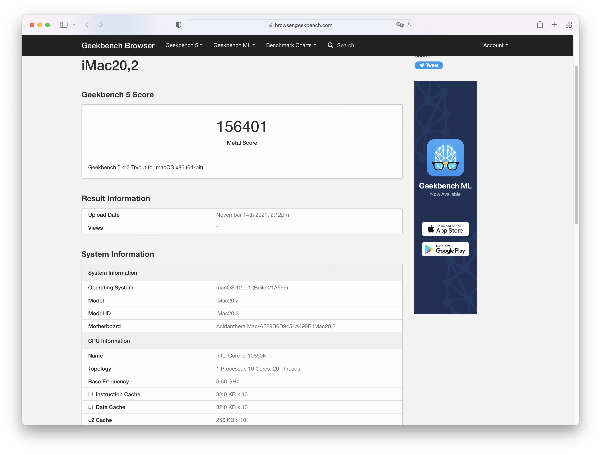
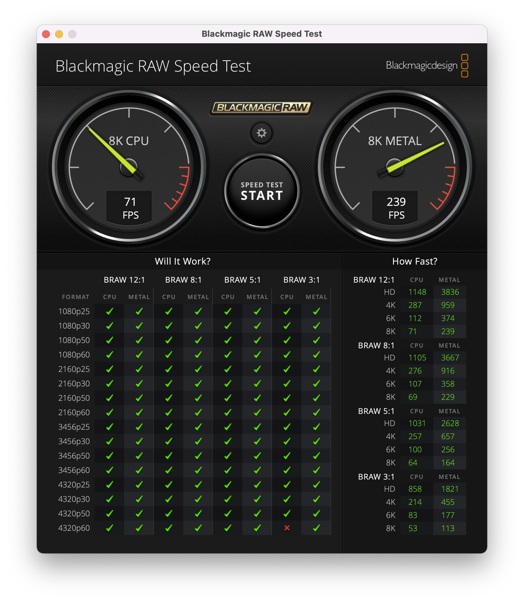

# ASUS ROG Z490G Hackintosh

Building a Hackintosh on ROG STRIX Z490-G GAMING using OpenCore.

## Software
| Name | Version |
| :-: | :-: |
| macOS | 13.2.1 |
| OpenCore | 0.8.9 |
| AppleALC | 1.8.0 |
| Lilu | 1.6.4 |
| NVMeFix | 1.1.1 |
| VirtualSMC | 1.3.1 |
| WhateverGreen | 1.6.5 |

## Hardware
| Part | Model | Comments |
| :-: | :-: | :-: |
| CPU | Intel Core i9-10850K | Remove power limit, OC to 5.0 GHz |
| MOBO | ASUS ROG Z490G | Non Wi-Fi Version |
| RAM | G.Skill Trident Z Royal 16G*2 4000 MHz C18| OC to 4400 MHz C18-24-24-44 |
| GPU | AMD RX 6800 | Support from macOS 11.4 onwards |
| Storage 1 | Sandisk Ultra 2TB | Used for OS installation and dualboot|
| Storage 2 | Hikvision C2000 Pro 1TB | Used for Time Machine |
| PSU | Corsair SF750 Platinum | |
| Wi-Fi Card | Fenvi T919 | Fenvi card, no kexts needed |

## Features
| Function | Status | Comments |
| :-: | :-: | :-: |
| USB | ✅ | See USB mapping section |
| Ethernet | ✅ | Using Apple's I225LM driver |
| Wi-Fi | ✅ | Need to add Wi-Fi card |
| Bluetooth | ✅ | Need to add Wi-Fi card |
| AirDrop, Handoff, Universal Clipboard | ✅ | Need to add Wi-Fi card |
| Hardware Acceleration | ✅ | Using AMD Hardware Acceleration, see Hardware Acceleration section |
| DRM | ✅ | Using AMD Hardware Acceleration |
| Sleep | ✅ | Need to use mouse to wake up |
| USB-C on dGPU | ✅ | For data transmission, XHCI-AMD6800.kext is needed, see USB-C section |
| Universal Control | ✅ | Tested with MacBook Pro 14-inch |

## Wi-Fi Card

Although this mobo has a version with the built-in Wi-Fi card, it's CNVi based which means we cannot swap it. Since it's a MATX board, we can add one PCIe Wi-Fi card.

There are quite limiting choices for a fully-support PCIe Wi-Fi card:

| Chipset | Model |
| :-: | :-: |
| BCM94360CD | Fenvi FV T919 (Bluetooth 4.0) Fenvi AC1900 (No Bluetooth, EOL) TP-LINK Archer T9E AC1900 (No Bluetooth, EOL) TP-LINK Archer T8E (No Bluetooth) RNX-AC1900PCE (No Bluetooth) ASUS PCE-AC66 (No Bluetooth) ASUS PCE-AC68 (No Bluetooth) |
| BCM94360CS2 | Fenvi FV-HB1200 (Bluetooth 4.0) AWD Wireless LAN Card (No Bluetooth) |
| BCM94352 | TP-LINK Archer T6 (No Bluetooth) Rosewill RNX-AC1300PCE (No Bluetooth) ASUS PCE-AC56 (No Bluetooth) |

Fenvi T919 is the best card among the bunch since it has 3 antennas for Wi-Fi and one for Bluetooth. 

Although lack of 802.11ax (Wi-Fi 6) support, 3 streams MIMO together with 80MHz and 400ns GI make its maximum speed to 1.3 Gbps, above 2 streams MIMO 80MHz Wi-Fi 6's 1.2 Gbps speed found on the new Apple Silicon MacBook Pros.

If you're not using a Fenvi card, then you'll need two more kexts for it to work:

[**AirportBrcmFixup**](https://github.com/acidanthera/AirportBrcmFixup/releases)

[**BrcmPatchRAM**](https://github.com/acidanthera/BrcmPatchRAM/releases)

<ul>
<li>BrcmBluetoothInjector</li>
<li>BrcmFirmwareData</li>
<li>BrcmPatchRAM3 for 10.14+, paired with BrcmBluetoothInjector</li>
</ul>

You need to put the required kexts in OC/Kexts. After that, run **File -> OC Snapshot** in ProperTree and choose your OC folder so the new kexts will be loaded.

Note that some of the legacy cards may need [patch](https://dortania.github.io/OpenCore-Install-Guide/extras/monterey.html#bluetooth) in macOS 12, try to avoid them if you can.

## Intel I255-V on macOS Ventura

By default macOS will load AppleEthernetE1000 (Apple's DEXT driver) for I255-V, however, this kext will cause kernel panic on my board once the ethernet cable is plugged (Maybe works for you) . Therefore, we have to force loading AppleIntelI210Ethernet.kext in OpenCore using bootarg `e1000=0`. macOS Ventura dropped AppleIntelI210Ethernet.kext, so we will add it as well.

## USB Mapping

This motherboard has several USB ports and they're defined as the following:

[**Image Source**](https://bootmacos.com/archives/9392)

For my personal use, I mapped SS03-04, SS07-08, SS09-10, HS11-12, and HS06 for Bluetooth due to the 15 ports limitation in macOS.

If you want to change the mapping, make your own USBMap.kext and replace the one in the OC/Kexts folder.

## BIOS
Few things need to be taken care of in the BIOS.

| Setting | Value|
| :-: | :-: |
| Fast Boot | Disable |
| Secure Boot | Disable |
| VT-d | Disable |
| CSM | Disable |
| Intel SGX | Disable |
| VT-x | Enable |
| Above 4G decoding | Enable |
| Hyper-Threading | Enable |
| XHCI Hand-off | Enable |
| DVMT Pre-Allocated | 64MB |
| SATA Mode | AHCI |
| iGPU Multi-Monitor | Enable |

Note: In the newer version of BIOS, when enabling **Above 4G decoding**, you may enable **Re-size BAR Support** if your hardware supports it. However, you need to make some changes to the config.plist, check out the Re-size BAR section. Make sure you connect the monitor to the dGPU.

## Hardware Acceleration and DRM

If you do not set hardware acceleration correctly, DRM-related content will not play. Since we're using a discrete AMD GPU here, we can make use of AMD's own hardware acceleration coder.

In the terminal, type the following commands one by one.

`defaults write com.apple.AppleGVA gvaForceAMDKE -bool YES`

`defaults write com.apple.AppleGVA gvaForceAMDAVCEncode -bool YES`

`defaults write com.apple.AppleGVA gvaForceAMDAVCDecode -bool YES`

`defaults write com.apple.AppleGVA gvaForceAMDHEVCDecode -bool YES`

These should make hardware acceleration work correctly and have no problem playing back DRM content.

## Re-size BAR

With the supported hardware, you may be able to enable re-size BAR in your BIOS under the PCI subsystem configuration tab in the BIOS.

macOS has no support for re-size BAR but starting from OpenCore 0.7.5, two quirks can be used to config it so that you can enjoy re-size BAR in Windows while not breaking macOS.

`Booter >> Quirks >> ResizeAppleGpuBars: reduces GPU PCI BAR size to be compatible with macOS.`

`UEFI >> Quirks >> ResizeGpuBars: configure the GPU PCI BAR size for systems other than macOS.`

For `ResizeAppleGpuBars`, you want to set it to `0` if you **enable** re-size BAR and `-1` if **disable** it. Other values may break macOS as discussed [here](https://www.insanelymac.com/forum/topic/349485-how-to-opencore-074-075-differences/).

For `ResizeGpuBars`, it depends on your GPU's memory. Set it to `n` where `n` is the minimal integer that makes `2^n MB` greater than or equal to the video memory you have.

For example, if I have 16GB video memory, then I should set it to `14` since `2^14 = 16384MB` which is basically 16GB.

## USB-C on RX 6800

By default, the USB-C port on RX 6800 only has the functionality of video output and power delivery due to the fact that macOS loads a wrong kext called **AppleAMDUSBXHCIPCI.kext**.

We'll use a custom kext based on XCHI-unsupported.kext called **XHCI-AMD6800.kext** to force macOS loads the correct kext **AppleUSBXHCIPCI.kext**.

## Modify config.plist in the OC Folder
This repository contains EFI based on OpenCore 0.8.9. If you're using the same mobo, then this EFI is likely working for you. But if you have different parts other than mobo, please read the following content and modify it accrodingly.

You need [ProperTree](https://github.com/corpnewt/ProperTree) to open and edit config.plist.

### DeviceProperties
Since I have both iGPU and dGPU, I set it as output by dGPU and iGPU is only used for hardware accleration.

If you wish to use the iGPU as output, you'll need to change **AAPL,ig-platform-id** from **0300C89B** to **00009B3E**.

`PciRoot(0x0)/Pci(0x1C,0x4)/Pci(0x0,0x0)` is used for tricking Apple's I225LM driver into supporting our I225-V network controller. If this does not work on your mobo, try `PciRoot(0x0)/Pci(0x1C,0x1)/Pci(0x0,0x0)`.

### NVRAM

For Navi users(RX 5000/6000 series), you need to add **agdpmod=pikera**.

If you hate all the debug info when booting, you can also remove **-v** parameter but I suggest you remove it only when your hacking is up and running fine.

### PlatformInfo
I left this part blank intentionally because you really need your own serial number.

To create a new serial number, you can use [GenSMBIOS](https://github.com/corpnewt/GenSMBIOS)

As for SMBIOS, it depends on your CPU:

| SMBIOS | CPU |
| :-: | :-: |
| iMac20,1 | i7-10700K and lower (8 core and lower) |
| iMac20,2 | i9-10850K and higher (10 core) |

Using GenSMBIOS, you'll get **Type** , **Serial** , **Board Serial** and **SmUUID**

**Type** goes to Generic -> SystemProductName

**Serial** goes to Generic -> SystemSerialNumber

**Board Serial** goes to Generic -> MLB

**SmUUID** goes to Generic -> SystemUUID

**TL;DR** You need your own serial number and if you have a different CPU or want to use iGPU as output, you need to change a few things in config.plist

## Screenshots and Benchmark (Tested on macOS 12.0.1)

**Hardware Info**

**Geekbench 5**

CPU Scores (M1 Max is around 1770 single and 12600 multi)

GPU Scores (Unstable due to the short benchmark period, can change from time to time)

Blackmagic Raw Speed Test

